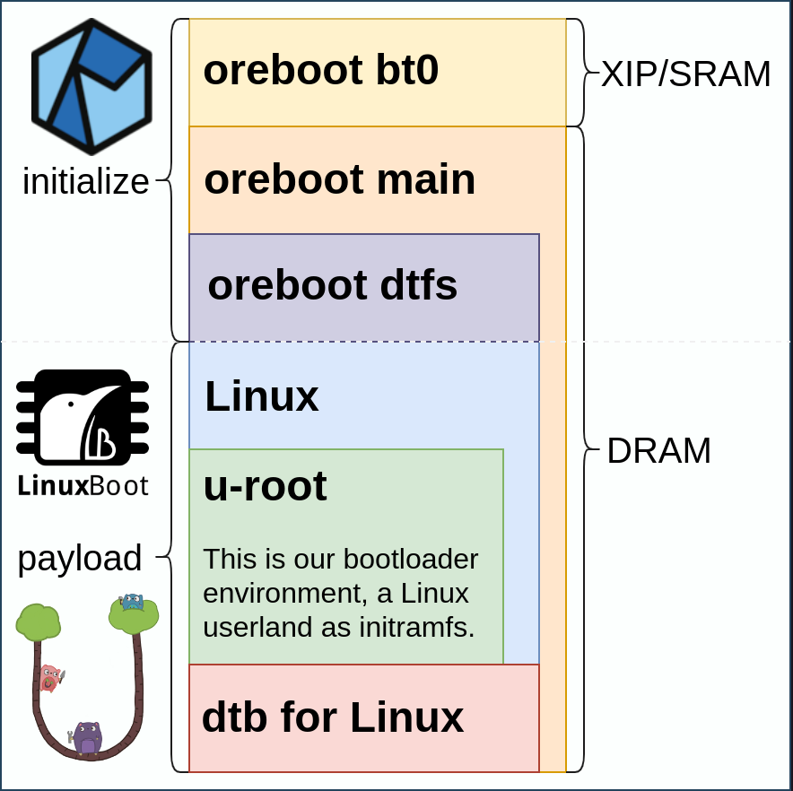

# Boot Flow

## Storage

Firmware resides in a storage part. One commonly used kind for firmware is
[flash storage](https://www.netapp.com/data-storage/what-is-flash-storage),
often SPI NOR, but other parts are possible as well, depending on the platform.
Those may be SPI NAND, which can hold larger amounts of data, eMMC/MMC, SD card,
USB drives, and in split scenarios, a fraction may even reside on the network.

For simplicity, we refer to a typical 16MB NOR flash in the following example.

### DTFS (Device Tree File System)

oreboot leaves a data structure in the storage that describes the overall layout
in the IEEE 1275 [Device Tree](https://www.devicetree.org/) format. This allows
for splitting up an image again and is defined per mainboard in a file named
`fixed-dtfs.dts`.

## Stages

Due to the nature of platforms, firmware needs to start small. From stage to
stage, we set up an environment such that an operating system may be booted or
any other payload executed.
With oreboot, we focus on embedding [LinuxBoot](https://linuxboot.org).

### Stage 0: Bootblock

For some specific platforms, such as x86, an initial bootblock stage may be
necessary. If present, this only covers a few instructions, e.g., to switch
processor modes. The x86 is still starting up in a 16bit mode as of 2022.

### Stage 1: SRAM/XIP

In the first stage, we initialize the main clocks, some GPIOs, a serial port,
and potentially light up LEDs to get early feedback. Then we initialize the DRAM
controller and make the large DRAM available. The only memory we have up to that
point is SRAM plus registers. Depending on the platform, [XIP (eXecute in-place)
](https://en.wikipedia.org/wiki/Execute_in_place) may be possible, e.g., when
the boot storage (NOR flash) is mapped to memory.

The final step in this early stage is to copy the next stage to DRAM and run it.

### Stage 2: DRAM

In the second stage, we are all set, and depending on the platform, we could
already run the final OS, a hypervisor, or any other payload. However, some
platforms require extra steps. For this example, we will look at RISC-V.

RISC-V describes [SBI](https://github.com/riscv-non-isa/riscv-sbi-doc), the
Supervisor Binary Interface, in the [privileged spec](
https://riscv.org/technical/specifications/). The role of SBI is to set up or
delegate exception and interrupt handling, register functions for the OS to call
into, and drop into a lower privileged mode named S-mode which makes an [MMU](
https://en.wikipedia.org/wiki/Memory_management_unit) available, and finally
execute the operating system. This is where we hand over to LinuxBoot, our
boot loader environment. In oreboot, we implement SBI via [RustSBI](
https://github.com/rustsbi/rustsbi), a Rust crate offering all the necessary
functions we need as a library.

### Stage 3: Payload (LinuxBoot)

In this final stage, we are presented with a Linux environment. To have all the
familiar commands, such as `ls`, `cat`, etc, as well as boot loaders, we choose
[u-root](https://u-root.org) to build our initramfs. However, you may as well
embed [cpud](https://github.com/u-root/cpu) directly, or your own custom app.

###  DTB (Device Tree Blob)

There are components on a compute platform that can be scanned for and detected
by the operating system, and others that need a fixed description instead. Those
can be passed to Linux and some other systems in the aforementioned [Device Tree
format](https://www.devicetree.org/). On RISC-V, the DTB needs to sit _behind_
the Linux kernel, and its memory location passed via defined registers. On some
platforms, e.g., x86, [ACPI](https://uefi.org/specs/ACPI/6.4/) is used instead.
