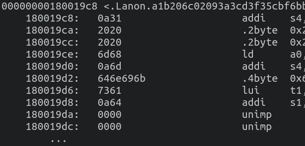

# Debugging

When running code, you may sometimes want to make sure it's running in the
expected region in memory that you defined in your linker script. If you happen
to mess this up, or you don't even know the base address, then the following
will help you figure it out.

## Creating pointers and printing them

If you need to know where a reference points to in memory, you can use the
`print_ptr` function from the `lib/log` crate. In order to do so, include the
log crate with the `"debug"` feature in your mainboard's `Cargo.toml` file:

```toml
log = { path = "../../../../lib/log", features = ["debug"] }
```


### Example output

Here is the corresponding output on the UART to the code above. Note that the
first pointer `0x080019DE` starts with a `0`, whereas the second one -
`0x180019E6` - starts with a `1`. The latter comes from a data section,
indicating that the base address in the linker script is wrong; in this instance,
it had to be changed from `0x18000000` to `0x08000000`.


### Corresponding objdump

In the following objdump, you can see the expected addresses where the strings
were trying to be read from:


