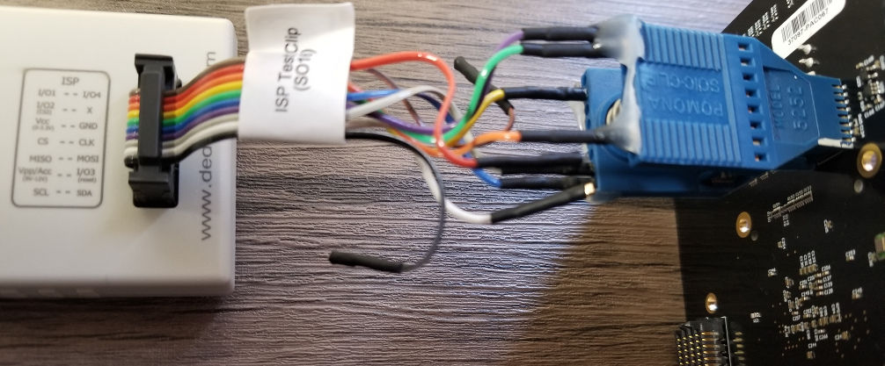
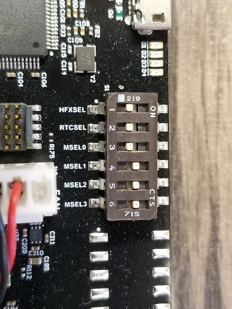
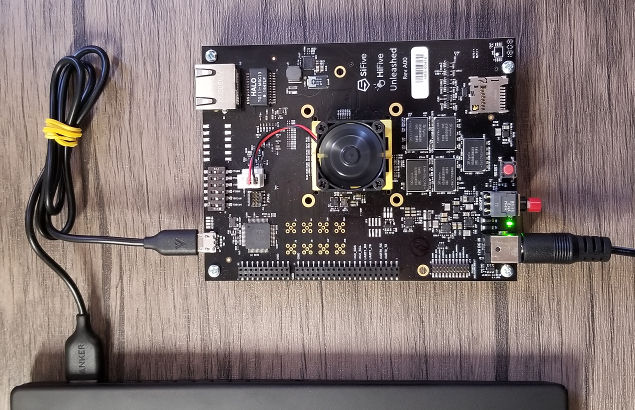

# HiFive Unleashed Setup

This tutorial gets you setup to run Oreboot on the HiFive Unleashed board.

1. Follow the main README to setup the Rust toolchain for RISC-V.

2. Confirm the build works by running Oreboot in QEMU. If it works, you should
   see the words "Welcome to oreboot" and "TESTTESTTEST" printed to your
   terminal.

```
cd src/mainboard/sifive/hifive
cargo make -p release run
```

| ⚠️ **WARNING:** If you modify the linker script lind.ld, you must "rm -rf" the target directory. |
| --- |

3. Create a flash image.

```
cargo make -p release
# The output is target/riscv64imac-unknown-none-elf/release/oreboot.bin
```

4. While flashing, make sure all external power is removed from the board.
   Using a 16-pin Pomona clip, connect a SF100 to the board as seen in the
   image below.



5. Flash it. Make sure to build flashrom from source (https://review.coreboot.org/cgit/flashrom.git/) because the debian packages tend to be too old.

```
sudo flashrom -p dediprog -w flash.rom
```

6. Oreboot is designed to be run immediately after the Zeroth Stage Boot Loader
   (ZSBL), skipping the First Stage Boot Loader (FSBL) and Berkley Boot Loader
   (BBL). To perform this skip and run Oreboot directly out of the SPI0
   flashchip, set the MSEL dip switches to the value of 0b0001. Note that the
   ON label is 0 on these switches.



7. Now connect power to a wall outlet and micro USB to your Linux computer. Use
   the big red power switch to power the board. Use the smaller red tact switch
   to reset the processor. When the board is powered, two new /dev/ttyUSBx
   devices should appear on your computer. The device with the higher number is
   UART0. Use minicom to see "Welcome to oreboot" and TESTTESTTEST printed.

```
minicom -D /dev/ttyUSB1 -b 115200
```




## Debugging with GDB

Use GDB+OpenOCD to debug hardware:

1. Build GDB for RISC-V

```
sudo apt-get install autoconf automake autotools-dev curl libmpc-dev \
	libmpfr-dev libgmp-dev gawk build-essential bison flex texinfo gperf \
        libtool patchutils bc zlib1g-dev libexpat-dev
git clone https://github.com/riscv/riscv-gnu-toolchain --recursive
cd riscv-gnu-toolchain
./configure --help
./configure --enable-linux --prefix=/opt/riscv
make -j12 build-gdb
stat /opt/riscv/bin/riscv64-unknown-linux-gnu-gdb
```

2. Build OpenOCD for RISC-V

```
git clone https://github.com/riscv/riscv-openocd
cd riscv-openocd
./bootstrap
./configure --help
./configure --enable-ftdi
make -j12
stat src/openocd
```

Download the HiFive Unleashed config from: https://github.com/sifive/freedom-u-sdk/blob/master/bsp/env/freedom-u500-unleashed/openocd.cfg

3. Start OpenOCD, use telnet to reset and run GDB:

```
openocd -f openocd.cfg

telnet locahost 4444
> reset halt

riscv64-unknown-linux-gnu-gdb
(gdb) target remote localhost:3333
(gdb) show threads
(gdb) thread 2
```
