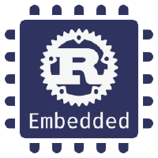
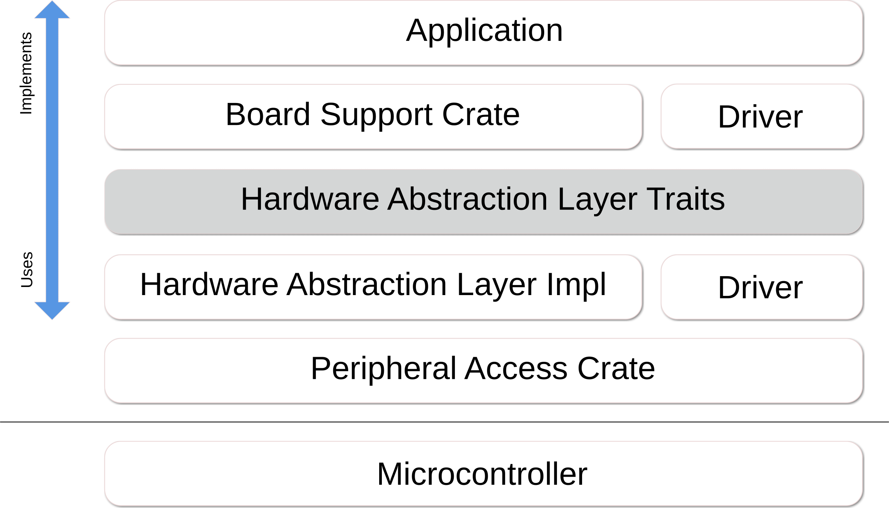

# oreboot README

[](https://github.com/oreboot/oreboot/actions/workflows/build.yml)


oreboot is a downstream fork of coreboot, i.e. oreboot is coreboot without 'c'.

oreboot is mostly written in Rust, with assembly where needed.

oreboot currently only plans to support LinuxBoot payloads.

## Demos

- [oreboot for ARM in QEMU](https://asciinema.org/a/Ne4Fwa4Wpt95dorEoVnHwiEkP)
- [oreboot for RISC-V HiFive Unleashed in QEMU](https://asciinema.org/a/XnWkMWTABuajsbGPMMTefjuZ2)

<details>
  <summary>Output sample from oreboot on Allwinner D1</summary>

```
oreboot 🦀
v 13
cpu_pll fa001000
cpu_axi 5000100
cpu_axi 5000100
peri0_ctrl was: f8216300
peri0_ctrl lock en
peri0_ctrl PLLs
peri0_ctrl set: f8216300
DDR3@792MHz
test OK
512M 🐏
NOR flash: c2/2018
load 00018000 bytes to 40000000: ➡️.
load 00fc0000 bytes to 44000000: ➡️➡️➡️➡️➡️➡️➡️➡️➡️➡️➡️➡️➡️➡️➡️➡️.
load 00010000 bytes to 41a00000: ➡️.
{ɕ serial uart0 initialized
RISC-V vendor 5b7 arch 0 imp 0
==== platform CSRs ====
   MXSTATUS  c0408000
   MHCR      00000109
   MCOR      00000002
   MHINT     00004000
see C906 manual p581 ff
=======================
Set up extension CSRs
==== platform CSRs ====
   MXSTATUS  c0638000
   MHCR      0000017f
   MCOR      00000003
   MHINT     0000610c
see C906 manual p581 ff
=======================
timer init
reset init
ipi init
RustSBI version 0.3.1
.______       __    __      _______.___________.  _______..______   __
|   _  \     |  |  |  |    /       |           | /       ||   _  \ |  |
|  |_)  |    |  |  |  |   |   (----`---|  |----`|   (----`|  |_)  ||  |
|      /     |  |  |  |    \   \       |  |      \   \    |   _  < |  |
|  |\  \----.|  `--'  |.----)   |      |  |  .----)   |   |  |_)  ||  |
| _| `._____| \______/ |_______/       |__|  |_______/    |______/ |__|
Platform Name: T-HEAD Xuantie Platform
Implementation: oreboot version 0.1.0
[rustsbi] misa: RV64ACDFIMSUVX
[rustsbi] mideleg: ssoftstimersext (0x222)
[rustsbi] medeleg: imaialmalasmasauecallipagelpagespage(0xb1f3)
[rustsbi] mie: msoft ssoft mtimer stimer mext sext (00000aaa)
PMP0     0x0 - 0x40000000 (A,R,W,X)
PMP1     0x40000000 - 0x40200000 (A,R)
PMP2     0x40200000 - 0x80000000 (A,R,W,X)
PMP3     0x80000000 - 0x80200000 (A,R)
PMP4     0x80200000 - 0xfffff800 (A,R,W,X)
PMP8     0x0 - 0x0 (A,R,W,X)
DTB looks fine, yay!
Decompress 12375521 bytes from 0x44000004 to 0x40200000, reserved 25165824 bytes
Success, decompressed 21910144 bytes :)
Payload looks like Linux Image, yay!
DTB still fine, yay!
Handing over to SBI, will continue at 0x40200000
enter supervisor at 40200000 with DTB from 41a00000
...
[    0.000000] OF: fdt: Ignoring memory range 0x40000000 - 0x40200000
[    0.000000] Machine model: Sipeed Lichee RV Dock
[    0.000000] earlycon: sbi0 at I/O port 0x0 (options '')
[    0.000000] printk: bootconsole [sbi0] enabled
[    0.000000] Zone ranges:
[    0.000000]   DMA32    [mem 0x0000000040200000-0x000000005fffffff]
[    0.000000]   Normal   empty
[    0.000000] Movable zone start for each node
[    0.000000] Early memory node ranges
[    0.000000]   node   0: [mem 0x0000000040200000-0x000000005fffffff]
[    0.000000] Initmem setup node 0 [mem 0x0000000040200000-0x000000005fffffff]
[    0.000000] riscv: SBI specification v1.0 detected
[    0.000000] riscv: SBI implementation ID=0x4 Version=0x301
[    0.000000] riscv: SBI TIME extension detected
[    0.000000] riscv: SBI IPI extension detected
[    0.000000] riscv: SBI SRST extension detected
[    0.000000] riscv: base ISA extensions acdfim
[    0.000000] riscv: ELF capabilities acdfim
[    0.000000] percpu: Embedded 17 pages/cpu s31912 r8192 d29528 u69632
[    0.000000] Built 1 zonelists, mobility grouping on.  Total pages: 128520
[    0.000000] Kernel command line: console=tty0 console=ttyS0,115200 loglevel=7 earlycon=sbi
```

</details>

## Rust Embedded



We build on top of the abstractions from the [Rust Embedded Working Group](https://github.com/rust-embedded)'s model with its crates and traits, detailed
in [their book](https://docs.rust-embedded.org/book/portability/index.html).

In a nutshell: 

## Vendor support

SoC vendors are expected to provide documentation to their cores, peripherals
and other blocks and/or their SVD files, so that we can generate the PAC and HAL
crates, or ideally, the vendor should _provide and maintain_ those as well.

The Rust Embedded book offers [design patterns and implementation guidelines](https://docs.rust-embedded.org/book/design-patterns/hal/index.html) as well as
a [glossary](https://docs.rust-embedded.org/book/appendix/glossary.html) to gain
an understanding of the structure.

## Boot Flow and Setup

To get a general understanding of how oreboot and firmware in general works,
have a look at the [boot flow documentation](Documentation/boot-flow.md). It
describes how firmware is stored and boots up on a platform / SoC.

## Getting oreboot

Clone this repo and enter its directory, i.e.:

```sh
git clone https://github.com/oreboot/oreboot.git
cd oreboot
```

## Prerequisites

In general, you will need the following packages installed:

- `device-tree-compiler`
- `pkg-config`
- `libssl`
- `rustup`

For Debian based systems, there is a make target to install those, which pulls
`rustup` through curl from https://sh.rustup.rs:

```sh
make debiansysprepare
```

Otherwise, install the package through your system package manager.

## Setting up the toolchain

Regardless of your OS, you will need to install the toolchain for oreboot.
This command only needs to be done once but it is safe to do it repeatedly.

```sh
make firsttime
```

## Keeping build tools up to date

Each time you start to work with oreboot, or even daily:

```sh
cd oreboot
make update
```

You should definitely do this before reporting any issues.

## Developing oreboot

There are two different things in the project:

1. `src/mainboards/*` the actual targets; those depend on and share crates, which
   can be drivers, SoC init code, and similar. For mainboards, `Cargo.lock`
   **must** be tracked.
2. `src/*` everything else; these are the aforementioned crates, for which, we
   do not track the `Cargo.lock` files.

Checking in a mainboard's `Cargo.lock` file records the state of its dependencies
at the time of a successful build, enabling reproducibility. Ideally, a lock file
is updated follwoing successful boot on hardware.

For more, see: https://doc.rust-lang.org/cargo/faq.html#why-do-binaries-have-cargolock-in-version-control-but-not-libraries

When creating a new mainboard, looking at how others are set up for the same
architecture is a good start. Be aware that oreboot is targeting bare metal, so
there is no standard library available.

## Building oreboot

To build oreboot for a specific platform, do this:

```
# Go to the mainboard's directory
cd src/mainboard/sunxi/nezha
# Build the mainboard target
make mainboard
# View disassembly
make objdump
# Run from RAM without flashing
make run
# Flash to the board
make flash
```

The root `Makefile` allows you to quickly build all platforms:

```
# build all mainboards
make mainboards
# build everything in parallel
make -j mainboards
```

## QEMU

```
# Install QEMU for your target platform, e.g. x86
sudo apt install qemu-system-x86

# Build release build and start with QEMU
cd src/mainboard/emulation/qemu-q35 && make run
# Quit qemu with CTRL-A X
```

To build QEMU from source for RISC-V:

```
git clone https://github.com/qemu/qemu && cd qemu
mkdir build-riscv64 && cd build-riscv64
../configure --target-list=riscv64-softmmu
make -j$(nproc)
# QEMU binary is at riscv64-softmmu/qemu-system-riscv64
```

To build QEMU from source for aarch64:

```
git clone https://github.com/qemu/qemu && cd qemu
mkdir build-aarch64 && cd build-aarch64
../configure --target-list=aarch64-softmmu
make -j$(nproc)
# QEMU binary is at aarch64-softmmu/qemu-system-aarch64
```

## Mainboards

Similar to coreboot, the structure in oreboot is per vendor and mainboard.
Multiple architectures and SoCs are supported respectively, and their common
code is shared between the boards. Boards may have variants if minor deviations
would otherwise cause too much code duplication.

### Emulation

- `qemu-riscv`

### Hardware

#### RISC-V

##### Allwinner D1 SoC

- Sipeed Lichee RV Dock / Dock Pro
- MangoPi MQ-Pro
- DongshanPi Nezha STU
- Allwinner Nezha

### Previous Implementations

For reference, [earlier approaches are documented](graveyard.md). Have a look at
those for x86 and Arm platforms and mainboards.

### Parked for Revival

Earlier emulation targets have been parked in `src.broken/mainboard/emulation/`.
They are supposed to provide a general understanding of each architecture that
oreboot seeks to support:

- `qemu-armv7`
- `qemu-aarch64`
- `qemu-q35`

## Ground Rules

- `Makefile`s must be simple. Use `xtask` instead for control flow, e.g., adding
  headers or checksums to the binaries, sitchting images, etc..
- `Cargo.toml` in the respective `src/mainboard/$VENDOR/$BOARD` (sub)directories
  allow for board-specific dependencies and building all stages in parallel.
- All code and markup is auto-formatted with `make format` with no exceptions.
  A CI check will tell if a change does not adhere to the formatting rules.
- There will be no code written in C. We write all code in Rust.
- We will not run our own Gerrit. We are using GitHub for now, and the GitHub
  Pull Request review mechanism.
- We will not run our own Jenkins. We will use the most appropriate CI; for
  now, that is GitHub, but we will be flexible.

## Copyright and License

The copyright on oreboot is owned by quite a large number of individual
developers and companies. Please check the individual source files for details.

oreboot is licensed under the terms of the GNU General Public License (GPL).
Some files are licensed under the "GPL (version 2, or any later version)",
and some files are licensed under the "GPL, version 2". For some parts, which
were derived from other projects, other (GPL-compatible) licenses may apply.
Please check the individual source files for details.

This makes the resulting oreboot images licensed under the GPL, version 2.
