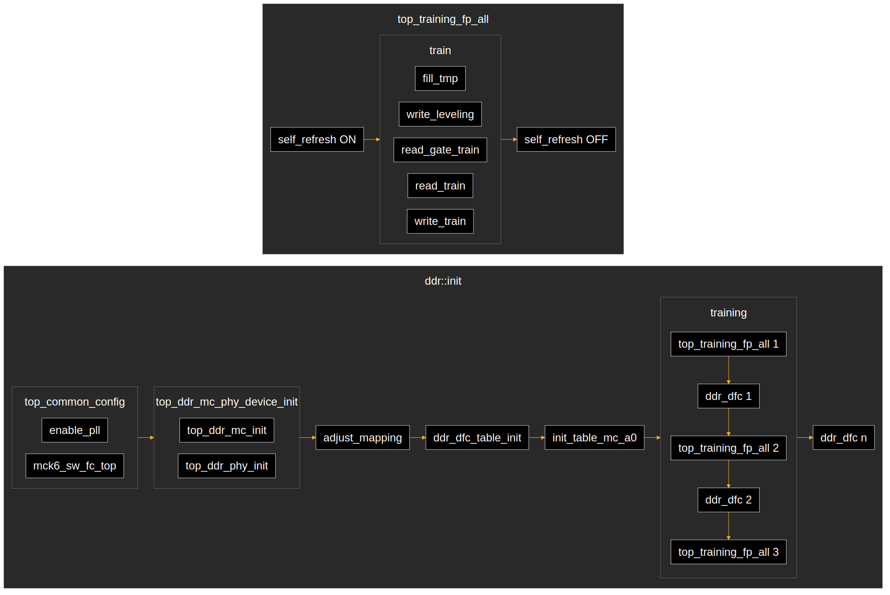

# SpacemiT K1x

<https://www.spacemit.com/en/key-stone-k1/>

There are two variants of this SoC: K1 and M1. M1 is a tad bit
more powerful.

There is also a rebranded one, named Ky X1, which is effectively
the same as the K1.

## Boards

- [BananaPi BPI-F3](https://docs.banana-pi.org/en/BPI-F3/BananaPi_BPI-F3) (K1)
- [OrangePi RV2](http://www.orangepi.org/html/hardWare/computerAndMicrocontrollers/details/Orange-Pi-RV2.html) (Ky X1)
- [OrangePi R2S](http://www.orangepi.org/html/hardWare/computerAndMicrocontrollers/details/Orange-Pi-R2S.html) (Ky X1)
- [MUSE Book](https://store.deepcomputing.io/products/muse-book) (M1)
- [MUSEPiPro](https://www.spacemit.com/spacemit-muse-pi-pro/) (M1)
- [Milk-V Jupiter](https://milkv.io/jupiter) (K1 or M1)

## Running code

Enter the mask ROM USB loader mode. Either keep a respective button pressed on
your board, or have no bootable media. On the BPI-F3, there are three buttons
next to the SD card slot. The one close to the SD card slot is for reset, the
one labeled _FDL_ (possibly _F_irmware _D_own_L_oad) is for the mask ROM mode.
So either keep FDL pressed on power-on, or keep it pressed and press reset.

SpacemiT offer a slow, graphical tool for flashing name titanflasher, which
really just wrap `fastboot`.
Instead, you can use `fastboot` directly (see also the [U-Boot docs](https://docs.u-boot.org/en/latest/board/spacemit/bananapi-f3.html)):

```sh
fastboot stage firmware.bin
fastboot continue
```

Here in oreboot, this is handled through the [`Makefile`](Makefile); run:

```sh
make run
```

## DRAM init

The DRAM initialization has been ported from C code in the vendor U-Boot fork
and the DRAM training translated from a binary contained as a byte array in a
header file.

SpacemiT have also published the full DRAM init + training code as a single
binary, from which the training itself can be extracted at offset `0x41c0`:
<https://github.com/spacemit-com/spacemit-firmware>
This has been verified to be identical to the binary that was contained in the
header file earlier.

The code here in oreboot is fully functional, and it has been tested on a wide
variety of boards with different DRAM configurations.

As part of the translation process, we have created a [flow chart](flow.chart)
that describes the function calls. Because the binary contained strings that
could be printed by passing a print function to it, some function names have
been restored; however, no correctness in their naming is guaranteed.
The flow chart has been created with Mermaid, and can be rebuilt by running

```sh
make flowchart
```

.
